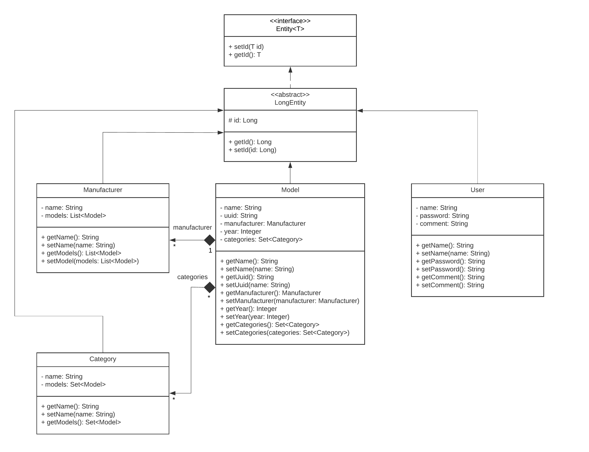

<!-- PROJECT LOGO -->
<!--suppress HtmlUnknownAnchorTarget, HtmlDeprecatedAttribute -->
 

  

<h3 align="center">Car Database</h3>
  

    An awesome Car Database!
  

<!-- ABOUT THE PROJECT -->
### About The Project
***
This is my pet project Car Database :)

<!-- UML DIAGRAM -->
### Project UML class diagram
***

  

(<a href="#readme-top">back to top</a>)
